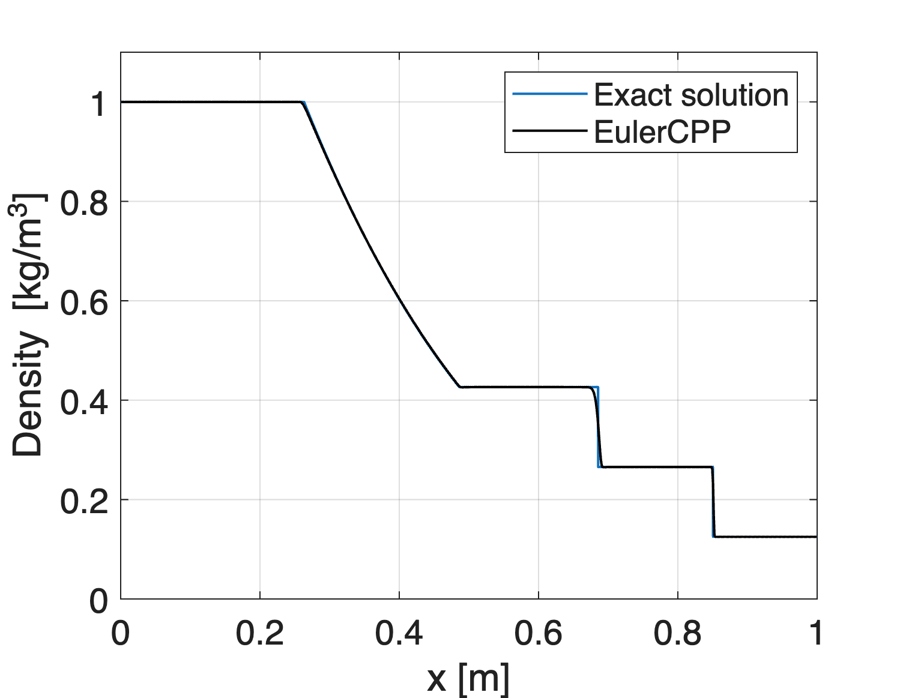
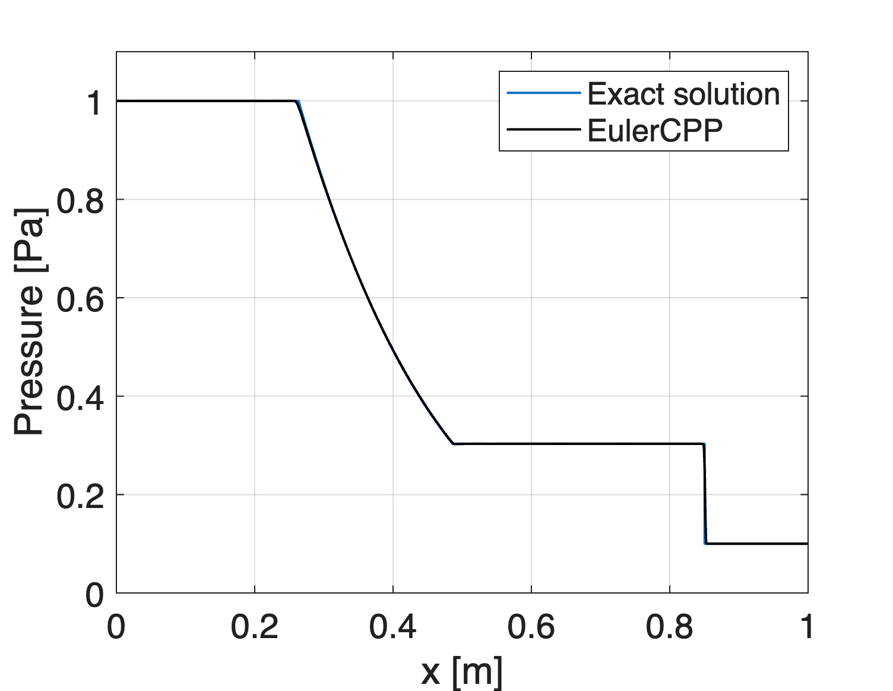
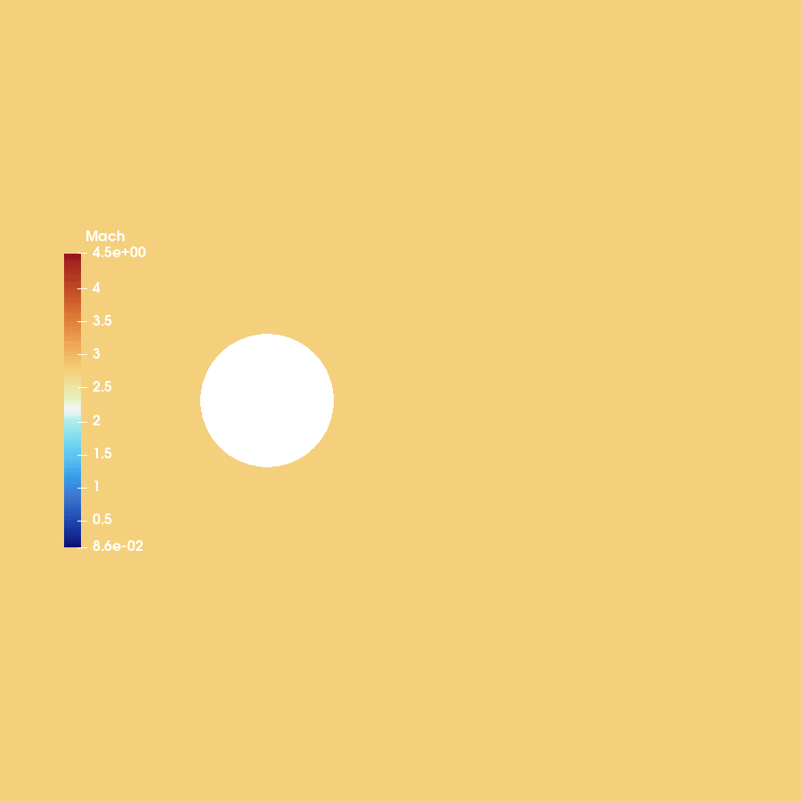
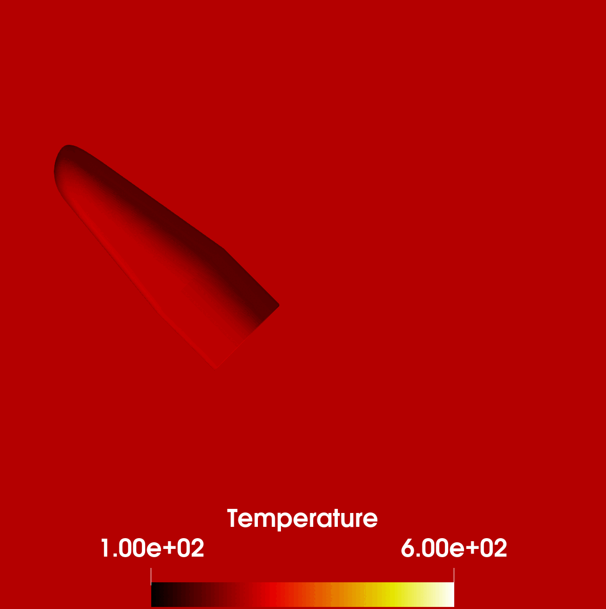

# EulerCPP


**EulerCPP** is a standalone CFD solver for the **compressible, inviscid Euler equations**, written in modern C++. It supports simulations in **1D, 2D (planar or axisymmetric) and full 3D geometries** on general **unstructured polyhedral meshes**.

At its core, EulerCPP provides several Riemann solvers for flux computation, including Rusanov, HLL, and HLLC. These can be selected via the input file, allowing flexibility depending on the problem requirements. Spatial accuracy is achieved through MUSCL reconstruction with slope limiters, while time integration is handled by an explicit multi-stage scheme, suitable for unsteady problems and shock-dominated flows.

Results are exported in the standard **VTK format** (ASCII or binary) or **CSV format**, making them easy to visualize with ParaView or similar post-processing tools. Parallelism is supported through **OpenMP**, enabling efficient use of multi-core CPUs.

## Examples

This section presents a set of canonical test cases demonstrating EulerCPP capabilities in 1D, 2D, axisymmetric and 3D flows.

### 1D Sod shock tube problem

The 1D Sod shock tube is a standard Riemann problem featuring a discontinuity in density and pressure, generating a shock, contact discontinuity, and expansion fan. It is widely used to validate shock-capturing schemes.

The figures below show results at time 0.2 seconds on a **1000 elements** mesh using the **HLLC Riemann solver**, **second-order MUSCL reconstruction** with **Venkatakrishnan slope limiter** and a **5-stage explicit time integration scheme**. Input file and mesh files used for this problem are available in the [examples](examples/sodtube) folder.

<div style="display: flex; flex-wrap: wrap; gap: 10px;">
  <div style="flex: 1 1 49%; min-width: 200px; text-align: center;">
    
    <p><em>Fig. 1: Density for 1D Sod shock tube</em></p>
  </div>
  <div style="flex: 1 1 49%; min-width: 200px; text-align: center;">
    
    <p><em>Fig. 2: Pressure for 1D Sod shock tube</em></p>
  </div>
</div>

### 2D Supersonic cylinder

The 2D supersonic cylinder case consists of uniform freestream flow at **Mach 3** impinging on a circular cylinder. A detached bow shock forms upstream of the cylinder, while a complex subsonic recirculation region develops in the wake. This benchmark is widely used to validate **shock-capturing capability in two dimensions**, as well as the treatment of **slip-wall boundaries** and far-field boundary conditions.

The animations below illustrate the development of the bow shock and the pressure field. Results were obtained using the **HLLC Riemann solver** and **second-order MUSCL reconstruction** with **Venkatakrishnan slope limiter**. Input file and mesh file used for this simulation are available in the [examples](examples/cylinder) folder.

<div style="display: flex; flex-wrap: wrap; gap: 10px;">
  <div style="flex: 1 1 49%; min-width: 200px; text-align: center;">
    
    <p><em>Fig. 3: Mach for supersonic cylinder</em></p>
  </div>
  <div style="flex: 1 1 49%; min-width: 200px; text-align: center;">
    
    <p><em>Fig. 4: Pressure for supersonic cylinder</em></p>
  </div>
</div>

### Axisymmetric rocket nozzle

This test case simulates compressible flow through a **convergent–divergent nozzle** in an **axisymmetric configuration**. The setup includes a stagnation chamber, throat, and expanding section, producing supersonic exhaust with a characteristic structure in the jet plume. The wake and shock interactions downstream are well-suited to demonstrate the solver’s **axisymmetric capabilities**.

The animation below shows the temperature field during the simulation, highlighting the supersonic expansion and shock patterns in the exhaust jet. Results were obtained using the **HLLC Riemann solver** and **second-order MUSCL reconstruction** with the **Venkatakrishnan slope limiter**. The input file and mesh used for this simulation are available in the [examples](examples/nozzle) folder.

<div style="display: flex; justify-content: center; margin: 10px 0;">
  <div style="flex: 1 1 100%; max-width: 800px; text-align: center;">
    
    <p><em>Fig. 5: Temperature for axisymmetric rocket nozzle</em></p>
  </div>
</div>

### 3D Intermediate eXperimental Vehicle

This example simulates the **final re-entry phase of the ESA Intermediate eXperimental Vehicle (IXV)**, a lifting body designed to demonstrate key re-entry technologies. The flow conditions correspond to **Mach 2 at 45° angle of attack**, producing a highly asymmetric shock system.

The case highlights the solver’s capability to handle **large-scale 3D unstructured meshes** (**over 5 million elements**) and to capture shocks around **complex geometries**.

Results were obtained using the **HLLC Riemann solver** and **second-order MUSCL reconstruction** with the **Venkatakrishnan slope limiter**.

<div style="display: flex; flex-wrap: wrap; gap: 10px;">
  <div style="flex: 1 1 49%; min-width: 200px; text-align: center;">
    
    <p><em>Fig. 6: Mach for IXV</em></p>
  </div>
  <div style="flex: 1 1 49%; min-width: 200px; text-align: center;">
    
    <p><em>Fig. 7: Temperature for IXV</em></p>
  </div>
</div>

## Installation

### Requirements

- [CMake](https://cmake.org/) (≥ 3.10)
- C++17 or newer compiler
- [OpenMP](https://www.openmp.org) (for parallelism)
- [Ninja](https://ninja-build.org) (recommended for Windows)

### Building

Use helper scripts:

```bash
# MacOS / Linux
./build.sh

# Windows (Powershell)
.\build.ps1
```

or build manually:

```bash
# MacOS / Linux
mkdir build
cd build
cmake ..
make

# Windows
mkdir build
cd build
cmake -G "Ninja" ..
cmake --build .
```

This will create the `eulercpp` executable in the `bin/` directory.

## Usage

Run a simulation by providing an input file:

```bash
./eulercpp input.inp
```

### Input file format

```bash
# EulerCPP input file example

# Notes:
# - Any line starting with `#` is a comment. 
# - Lines with an `=` sign are parsed as key = value pairs.

# Logger settings
# Controls verbosity and logging output.
# verbosity: (0 = silent, ..., 5 = debug)
# log_file: optional path to log file
# rhs_file: optional file for residual history 
#           (if provided, residuals are written only there)
verbosity=4
log_file=output.log

# Physics settings
# dimension: problem dimensionality
# 0 = 1D, 1 = 2D (XY), 2 = Axisymmetric (XY, X-axis), 3 = 3D
dimension=1

# Mesh settings
# mesh_file: path to mesh file in gmsh 2.2 format (.msh).
# min_volume: minimum allowed element volume.
mesh_file=mesh.msh
min_volume=1.0e-20

# Fluid settings
# R: specific gas constant [J/kgK]
# gamma: heat capacity ratio
R=287.0
gamma=1.4

# Solver settings
# time_stages: number of time integration stages
# a: coefficients for multi-stage time integration
# CFL: CFL number
# maxtime: maximum physical simulation time
# maxiter: maximum number of iterations
# reconstruction: 0 = 1st order, 1 = 2nd order (MUSCL)
# limiter: slope limiter
#    0 = minmod, 1 = superbee, 2 = van Leer,
#    3 = Venkatakrishnan, 4 = modified Venkatakrishnan
# riemann: riemann solver
#    0 = Rusanov, 1 = HLL, 2 = HLLC
time_stages=5
a=0.25,0.1666667,0.375,0.5,1.0
CFL=0.8
maxtime=0.2
maxiter=10000
reconstruction=1
limiter=3
riemann=2

# Output settings
# output_format: 0 = VTK binary, 1 = VTK ASCII, 2 = CSV
# output_delay: iterations between solution dumps
# prints_delay: iterations between printing residuals
# prints_info_delay: iterations between printing header
# restart_delay: iterations between restart file saves
# output_folder: directory for output files
# output_name: prefix for output/restart files
output_format=0
output_delay=1000
prints_delay=1
prints_info_delay=20
restart_delay=500
output_folder=output
output_name=output

# Initial conditions
# - restart: 0 = start from scratch, 1 = start from restart file
# - restart_file: path to restart file (if restart=1)
# - initial_variables: 
#    0 = specify T_0
#    1 = specify rho_0
# - additional_blocks: number of override regions (boxes)
#
# Default block defines the background state.
# Each block_b overrides it in a defined region:
#   p_b, rho_b (or T_b), u_b, v_b, w_b
#   xmin_b, xmax_b, ymin_b, ymax_b, zmin_b, zmax_b
restart=0
restart_file=output/output.restart
initial_variables=1
additional_blocks=1

# Default block
p_0=1.0
rho_0=1.0
u_0=0.0
v_0=0.0
w_0=0.0

# Block 1
p_1=0.1
rho_1=0.125
u_1=0.0
v_1=0.0
w_1=0.0
xmin_1=0.5

# Boundary conditions
# n_boundaries: number of boundary conditions
# For each boundary:
#   bc_X: boundary type (integer code)
#       - 0 = Supersonic inflow
#       - 1 = Supersonic outflow
#       - 2 = Stagnation inlet
#       - 3 = Subsonic inflow
#       - 4 = Pressure outlet
#       - 5 = Wall (same as symmetry)
#       - 6 = Symmetry condition
#       - 7 = Slip wall (same as symmetry)
#       - 8 = Moving wall (same as symmetry)
#       - 9 = Axis condition
#   bc_X_var_Y: boundary variables (depend on type)
#       Supersonic inflow: [Mach, p, T, alpha, phi]
#           (alpha and phi are flow direction angles)
#       Stagnation inlet: [Htot, Ptot, Psup, alpha, phi]
#       Subsonic inflow: [T, u, v, w]
#       Pressure outlet: [p]
#       Others: []
#   bc_X_xmin, xmax, ymin, ymax, zmin, zmax: bounding box
n_boundaries=1
bc_1=6

# Example of a supersonic inlet from the left of the domain:
# bc_1=0 (Supersonic inflow)
# bc_1_var_1 = 3.0 (Mach number)
# bc_1_var_2 = 101325.0 (Pressure)
# bc_1_var_3 = 300.0 (Temperature)
# bc_1_var_4 = 0.0 (Alpha angle)
# bc_1_var_5 = 0.0 (Phi angle)
# bc_1_xmax = -2.0 (X-bounded)
```

## API Reference
Full API reference generated with [Doxygen](https://www.doxygen.nl), with the help of [ChatGPT](https://chatgpt.com).

See the provided [Doxyfile](Doxyfile) and build with:

```bash
doxygen Doxyfile
```

## Changelog

See [CHANGELOG.md](CHANGELOG.md)

## License

See [LICENSE](LICENSE)
